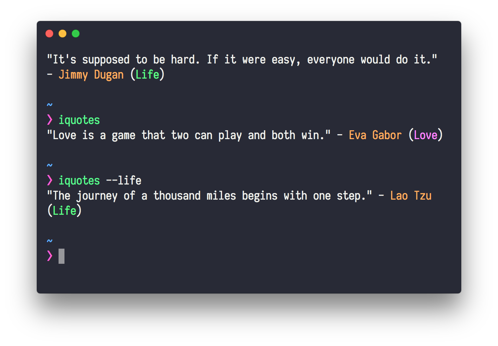

# iquotes-cli 

> Get inspirational quotes

[](https://travis-ci.org/banminkyoz/iquotes-cli) [](http://badge.fury.io/js/iquotes-cli) [](https://github.com/xojs/xo)

<p align="center">
  
</p>

## Install

```
$ npm install iquotes-cli
```

## Usage

```js
$ iquotes
// "If you really want to do something, you'll find a way. If you don't, you'll find an excuse." - Jim Rohn (Life)
$ iquotes --love
// "The first duty of love is to listen." - Paul Tillich (Love)
```

## Related

- [iquotes](https://github.com/banminkyoz/iquotes) - API of this module

## License

MIT © [Kyoz](mailto:banminkyoz@gmail.com)